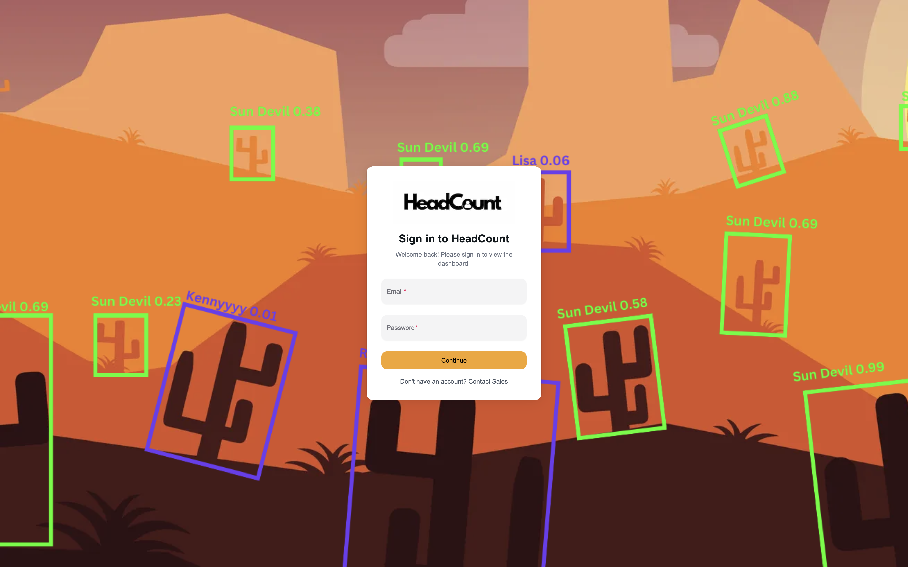
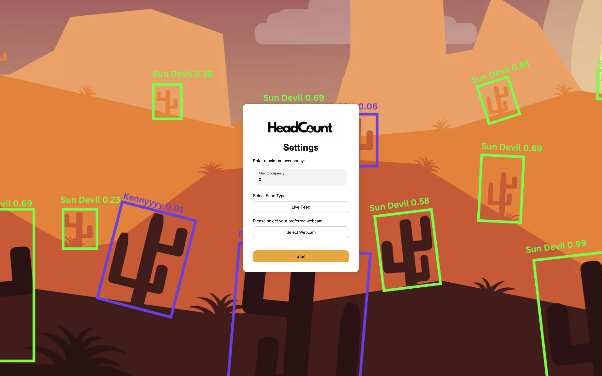
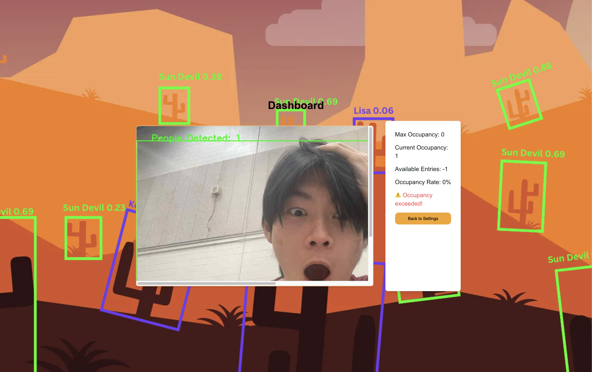

# **HeadCount**

This project is a web-based application for managing and monitoring occupancy in real-time using machine learning. It uses a combination of **React (Next.js)** for the front end and **FastAPI** for the back end to provide real-time occupancy data, live video feed monitoring, and access control. The system includes user authentication and settings customization.

## Table of Contents

- [Features](#features)
- [Technologies Used](#technologies-used)
- [Setup Instructions](#setup-instructions)
- [Running the Project](#running-the-project)
- [Endpoints Overview](#overview)
- [Frontend Pages](#frontend-pages)
- [API Endpoints](#api-endpoints)
- [Future Improvements](#future-improvements)

## Features

- **Real-time Occupancy Tracking**: Monitors and updates the current occupancy with an alert when capacity is exceeded.
- **Live Video Feed**: Displays a live video feed from a connected webcam or video stream.
- **Computer vision**: Identify and count people in the video/live feed from the webcam using machine-learning.
- **User Authentication**: Users need to log in to access the dashboard and settings.
- **Settings Customization**: Administrators can set occupancy limits and configure the local webcam from the settings page.
- **Responsive UI**: The frontend is fully responsive, ensuring it works seamlessly across devices.

## Technologies Used

### Frontend

- **React (Next.js)**: Framework for building the user interface.
- **TypeScript**: Strongly typed JavaScript used for frontend logic.
- **Axios**: HTTP client for making API requests.
- **Tailwind CSS**: Utility-first CSS framework for styling.
- **Webcam / Video Feed Integration**: Uses `iframe` to stream the live feed from the FastAPI backend.

### Backend

- **FastAPI**: Python web framework to handle API requests and serve the live video feed.
- **OpenCV**: For real-time computer vision tasks such as object detection and live video feed processing using YOlOv4.
- **CORS Middleware**: To handle Cross-Origin Resource Sharing between frontend and backend.

## Setup Instructions

### Prerequisites

- **Node.js** (for running the Next.js frontend)
- **Python 3.7+** (for running the FastAPI backend)
- **Virtual environment** (optional but recommended)

### Clone the Repository

```bash
git clone https://github.com/yourusername/occupancy-dashboard.git
cd occupancy-dashboard
```

### Setup

#### Frontend Setup

1. Navigate to the frontend directory (if applicable):

   ```bash
   cd frontend
   ```

2. Install dependencies:

   ```bash
   npm install
   ```

3. Start the frontend:

   ```bash
   npm run dev
   ```

The frontend will now run at `http://localhost:3000`

#### Backend Setup

1. Navigate to the backend directory:

   ```bash
   cd backend
   ```

2. Install dependencies:

   ```bash
   pip install -r requirements.txt
   ```

3. Run application:

   ```bash
   uvicorn app.main:app --reload
   ```

The backend will now run at `http://localhost:8000`

## Running the Project

To run the project, ensure both the frontend and backend are running simultaneously. Open two terminal windows or tabs and navigate to the respective directories to start each service.

## Overview

### Frontend Pages

- **Login Page**: Allows users to log in to access the dashboard and settings.

  

- **Settings Page**: Enables administrators to configure occupancy limits and webcam settings.

  

- **Dashboard**: Displays real-time occupancy data and live video feed.

  

### API Endpoints

- **GET /occupancy**: Retrieves current occupancy data.
- **POST /login**: Authenticates a user.
- **GET /video-feed**: Streams live video feed.

## Future Improvements

- Scale the service up to support multiple users analyzing video in parallel.
